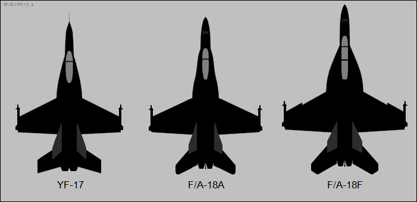

# Naval Aircraft

## Training

## Recon

## Cargo

## Unmanned Aerial Vehicles (UAV)

## Fighters

### NextGen Fighters

### 5th Generation Fighters

### 4th Generation Fighters
[F/A 18 Super Hornet](https://en.wikipedia.org/wiki/Boeing_F/A-18E/F_Super_Hornet)

The Boeing F/A-18E and F/A-18F Super Hornet are a series of American supersonic twin-engine, carrier-capable, multirole fighter aircraft derived from the McDonnell Douglas F/A-18 Hornet, in service with the armed forces of the U.S., Australia, and Kuwait. The F/A-18E single-seat and F/A-18F tandem-seat variants are larger and more advanced versions of the F/A-18C and D Hornet, respectively.

The Super Hornet has an internal 20mm M61A2 rotary cannon and can carry air-to-air missiles, air-to-surface and a variety of other weapons. Additional fuel can be carried in up to five external fuel tanks and the aircraft can be configured as an airborne tanker by adding an external air-to-air refueling system.

Designed and initially produced by McDonnell Douglas, the Super Hornet first flew in 1995. Low-rate production began in early 1997, reaching full-rate production in September 1997, after the merger of McDonnell Douglas and Boeing the previous month. The Super Hornet entered fleet service with the United States Navy in 1999, replacing the Grumman F-14 Tomcat, which was retired in 2006; the Super Hornet has served alongside the original Hornet. The Royal Australian Air Force (RAAF), which has operated the F/A-18A as its main fighter since 1984, ordered the F/A-18F in 2007 to replace its aging General Dynamics F-111C fleet. The Super Hornets of the RAAF entered service in December 2010. In February 2023, Boeing announced plans to end production of the Super Hornet in 2025.